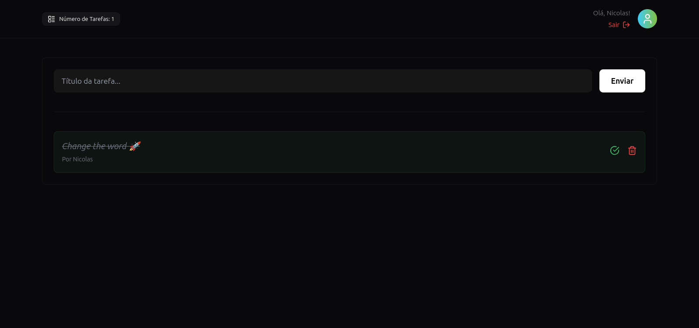

<a id="readme-top"></a>

<!-- PROJECT LOGO -->
<br />
<div align="center">
  <h3 align="center">Simple React State Manager</h3>

  <p align="center">
    <a href="https://state-manager.nicolasteofilo.dev/" target="_blank">View Demo</a>
    ·
    <a href="https://github.com/nicolasteofilo/state-manager-react/issues/new">Report Bug</a>
    ·
    <a href="https://github.com/nicolasteofilo/state-manager-react/issues/new?">Request Feature</a>
  </p>
</div>

<!-- ABOUT THE PROJECT -->
### About The Project

A state manager built from scratch, which avoids unnecessary rendering of state managers like the Context API. The Zustand library was used as the main reference for creating the methods. As an example application, a task list application was used, but the state manager can be applied to any other situation.



### Built With
* 
* 

### Installation
To get a local copy up and running follow these simple example steps.

1. Clone the repo
   ```sh
   git clone https://github.com/nicolasteofilo/state-manager-react
   ```
2. Install NPM packages
   ```sh
   yarn
   ```
3. Run project
   ```sh
   yarn dev
   ```

<!-- CONTRIBUTING -->
### Contributing

Contributions are what make the open source community such an amazing place to learn, inspire, and create. Any contributions you make are **greatly appreciated**.

If you have a suggestion that would make this better, please fork the repo and create a pull request. You can also simply open an issue with the tag "enhancement".
Don't forget to give the project a star! Thanks again!

1. Fork the Project
2. Create your Feature Branch (`git checkout -b feature/amazingFeature`)
3. Commit your Changes (`git commit -m 'Add some amazingFeature'`)
4. Push to the Branch (`git push origin feature/amazingFeature`)
5. Open a Pull Request


<!-- LICENSE -->
### License

Distributed under the MIT License. See `LICENSE.txt` for more information.

<!-- CONTACT -->
### Contact

Nicolas Teófilo - nicolasteofilodecastro@gmail.com

Project Link: [https://github.com/nicolasteofilo/state-manager-react](https://github.com/nicolasteofilo/state-manager-react)
